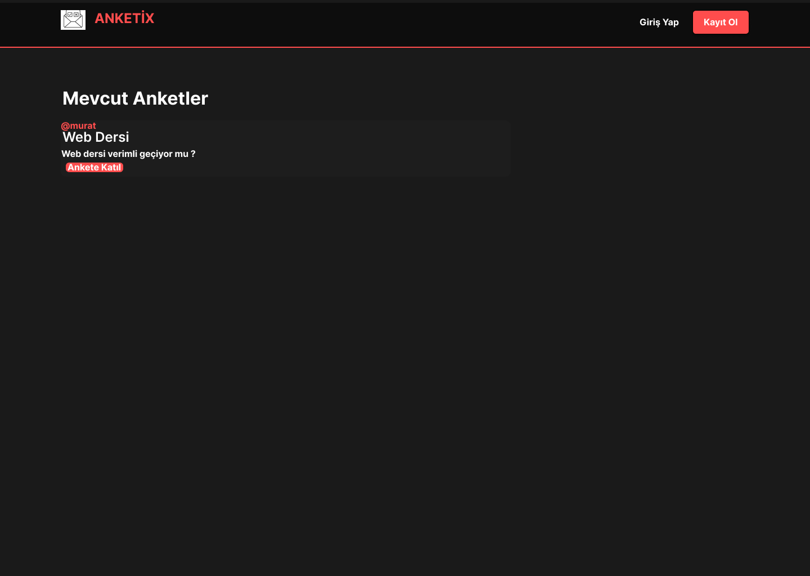

# 📊 Anketix - Django Anket Uygulaması

Bu proje, Django framework'ü kullanılarak geliştirilmiş, modern siyah-kırmızı temalı bir anket platformudur.

## 🎨 Arayüz Tasarımı
Tasarımın tam boyutlu halini görmek veya Figma üzerinden incelemek için aşağıdaki görselin üzerine tıklayabilirsiniz.

## 🚀 Özellikler
* Kullanıcı Kayıt ve Giriş Sistemi
* Dinamik Seçenekli Anket Oluşturma
* Canlı Oy Verme ve Sonuç Görüntüleme
* Responsive Modern Tasarım

## 🛠️ Kurulum
1. `git clone https://github.com/theMuratt7/Django_uygulamalar-.git`
2. `cd mysite`
3. `python manage.py migrate`
4. `python manage.py runserver`
